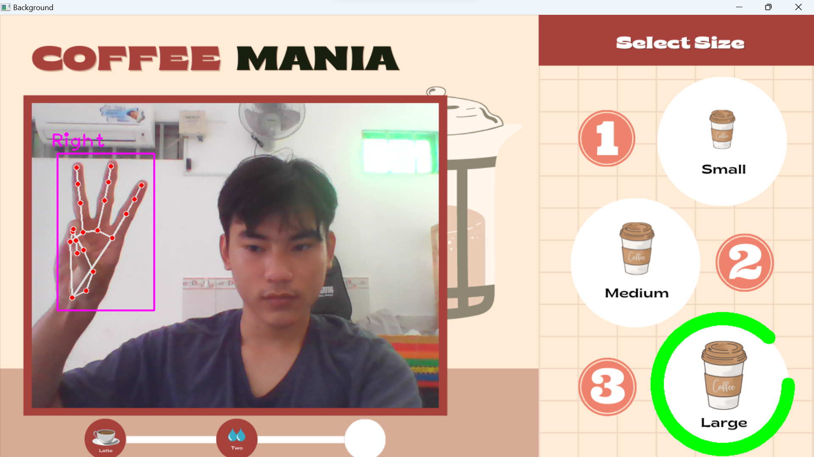

# Order_Coffee_Machine_CV
"Order_Coffee_Machine_CV" is a project that uses computer vision and hand gestures. 
It offers a fun, touchless way for users to select coffee types or customizations through webcam-based recognition, 
displaying coffee icons and using gestures to make selections.

# Screenshot

